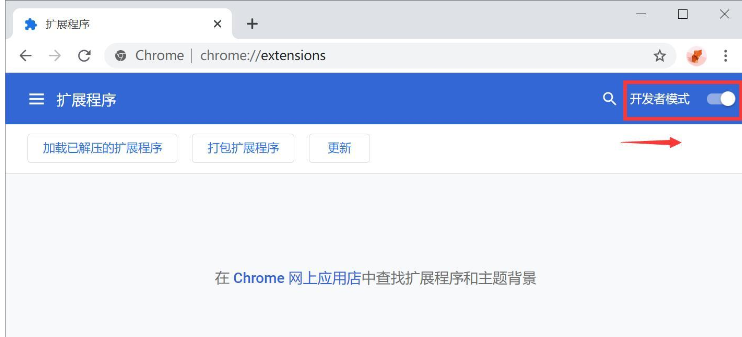

# Background
[Merlin Plugin](https://chromewebstore.google.com/detail/merlin-1-click-access-to/camppjleccjaphfdbohjdohecfnoikec) allows free users to utilize a daily free quota of CHATGPT3.5/4 or other AI models. To take advantage of this, users may register multiple accounts and conveniently switch between them using this plugin to maximize free usage.

# Introduction

This plugin is a Google Chrome extension customized for the website "https://app.getmerlin.in/". It aims to streamline user interaction with the IndexedDB database on the website, providing data import and export functionality. Users can easily back up data from the website and restore it when needed.

**Key Features:**

1. **Data Export**: Clicking the "Export" button in the plugin will access the website's IndexedDB database, export all data, and save it as a file. Users can save this file locally for future use.

2. **Data Import**: Clicking the "Import" button in the plugin prompts the user to select a previously exported data file. Once the file is selected, the plugin reads the data from the file and imports it into the website's IndexedDB database, allowing users to easily restore previously backed-up data.

**Usage Scenarios:**

- Data Backup: Users can regularly use this plugin to export data from the website to prevent data loss or damage.
- Data Migration: When users need to migrate data between different devices or browsers, they can use this plugin to export data from the source device and import it into the target device.
- Data Recovery: In case of data loss or damage, users can use this plugin to import previously backed-up data to restore the website's functionality.

By providing simple and user-friendly data import and export functionality, this plugin brings convenience to website users and enhances data security.

> Q: Occasionally, clicking the import button doesn't work, and the console shows the warning: "File chooser dialog can only be shown with a user activation."

> A: This issue is due to browser security policies that restrict calling the file selector without user activation. Importing may work immediately after a browser refresh, but will trigger this browser warning causing the functionality to become ineffective after a period of time.

> Q: No response when clicking the export button.

> A: Ensure that you are logged into your account.  
# Installation Guide

## 1. Download the Plugin

Click on the [Releases](https://github.com/Scipline/MerlinDBManage/releases) page to download the latest version of the plugin.

## 2. Install the Plugin

### 2.1. Unzip the Plugin

Unzip the downloaded plugin to your local drive, you will need a stable file path.

### 2.2. Enable Developer Mode

In the Chrome browser, click on the extensions icon, then select "Developer Mode" in the pop-up page.

### 2.3. Load the Plugin

Select "Load Unpacked Extension", then choose the unzipped folder.
## 3. Start Using
  
